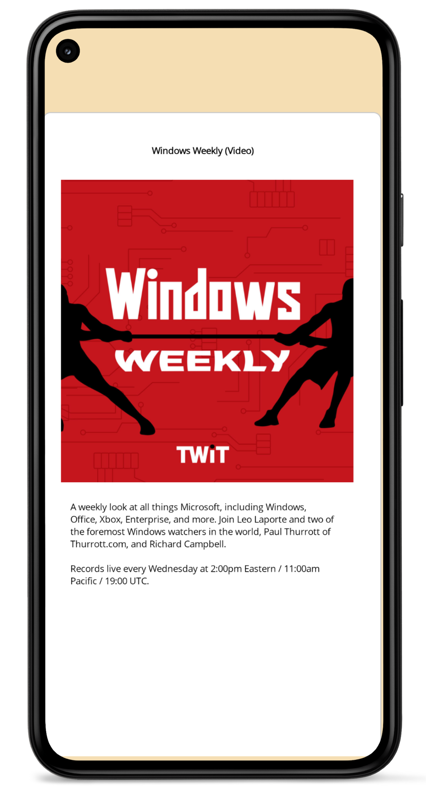
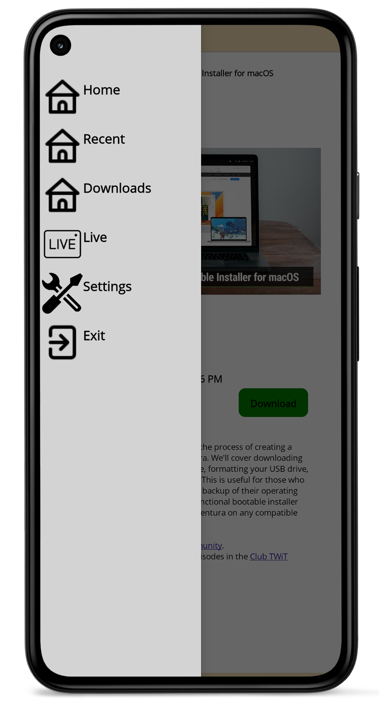
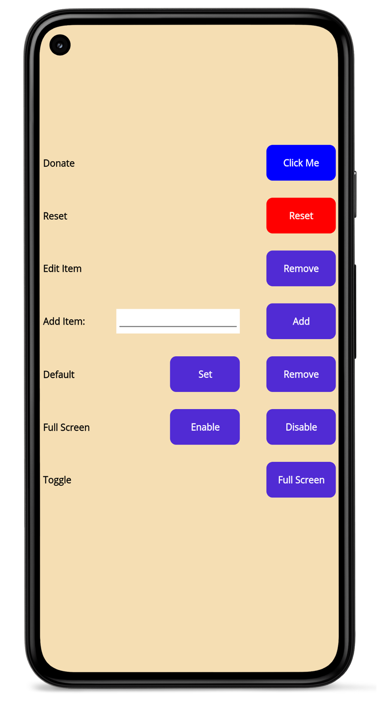
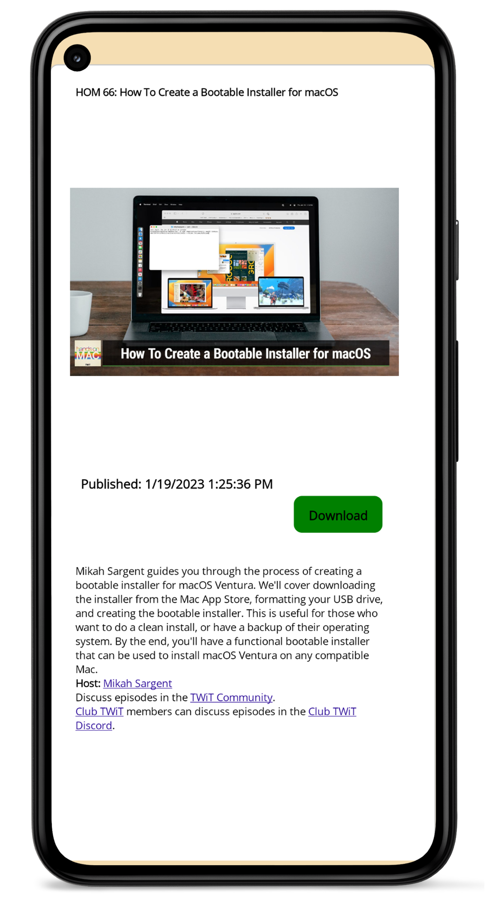
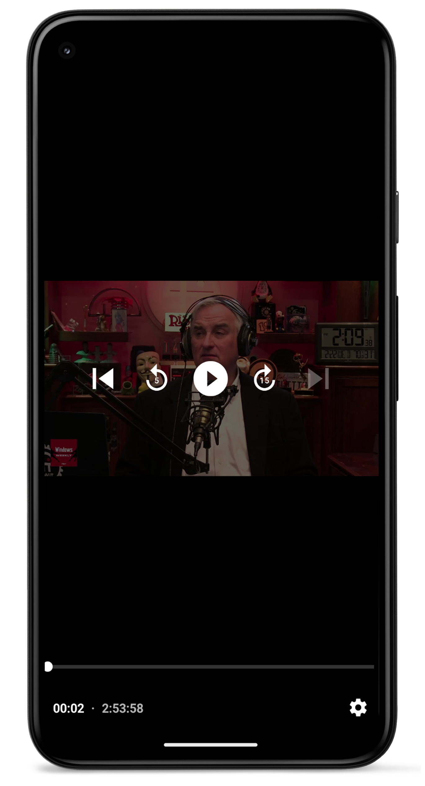
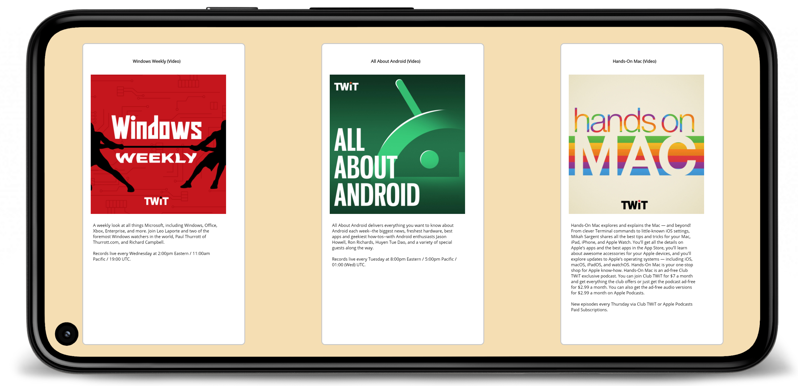
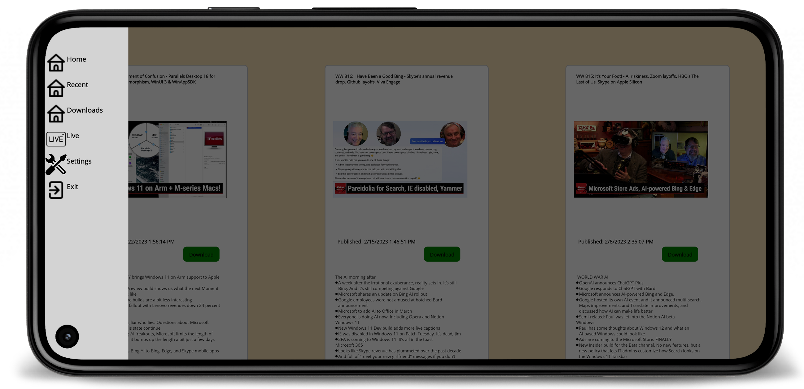
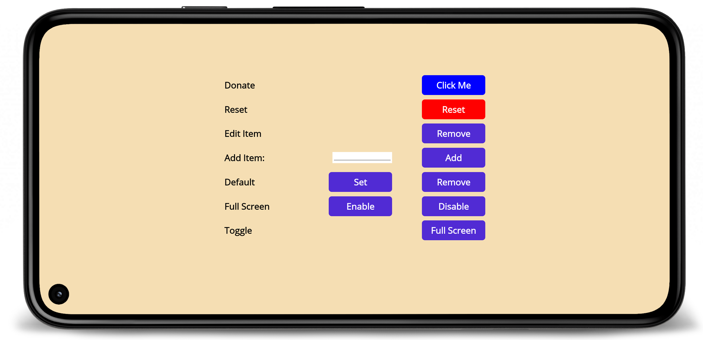
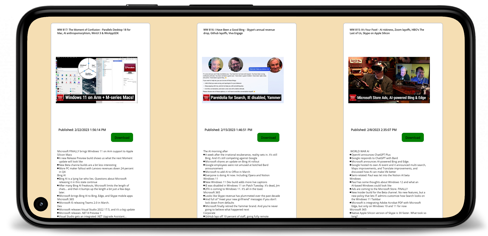
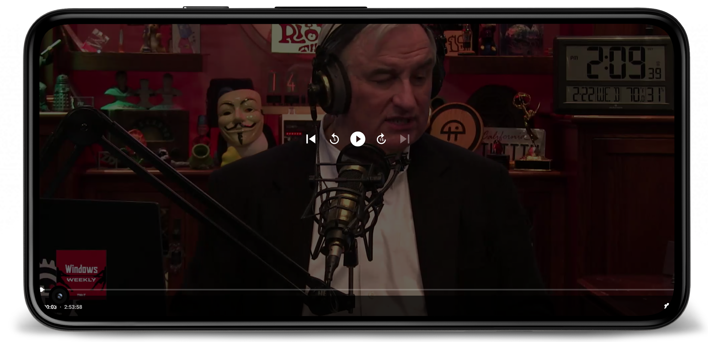

<h1 align="center">NerdNewsNavigator2</h1>

A Dotnet Maui Video player for Twit.tv RSS feeds. Browse latest episodes from Twit tv network RSS feeds and watch live as they are broadcasted.
Or download them for offline watching. Automatically keeps track of playback position and when video is resumed it starts where you left off. 
Podcast list is updated automatically every 30 days, or it can manually be updated in settings. App also allows you to choose to download only
when wifi is connected. Save you data!

## Current Features implemented
1. Browser RSS feed in a nice menu based layout.
2. Watch the latest episodes currently available from twit.tv
3. Playback tracking on an indivual stream and device
4. Add or remove both default and custom podcasts from twit.tv
5. There is a reset button in case you want to go back to defaults
6. Always on screen now works. It is set on during video playback. It turns off automatically after playback ends. No more dead phone/tablet if you fall asleep listening to podcast.
7. Startup behavior fixed! It now does not appear to freeze up when running for the first time, or during reset of app.
8. List of most recent show from each podcast now has a dedicated page.
9. Full screen toggle, with the ability to toggle always on/off for fullscreen or choose at any time whether fullscreen or not. It is your choice.
10. Downloader implemented on Show page. Shows can be accessed through downloads in flyout menu.
11. Automatic download of most recent favorite shows is now implemented.
12. A button to control automatic downloads has been placed in settings.

## TODO
1. Work on better UI implementation.
2. Add syncing between devices to track playback. Currently it is by individual device and has no awareness of other devices or platforms.
3. Release on Apple store
4. Respond to feedback
5. Optimize UI from feedback

## Suggestions/Bugs?
If you see any bugs or have any suggestions please open an issue and/or contact ne0rmatrix in Club twit discord.

## Link to current release
Free Version:
- [Current Releases](https://github.com/ne0rrmatrix/NerdNewsNavigator2/releases) &nbsp; 

  
Paid Version:
- [Microsoft store link](https://www.microsoft.com/store/apps/9N28GJQGP369)
- [Google Play link](https://play.google.com/store/apps/details?id=com.ahdftech.nerdNewsNavigator)

    

## Phone:
   
 
 
 
 

   
## Tablet:
   

 
 
 

   

## Help support me work on this project
If you enjoy using the app consider supporting development by purchasing on Microsoft store or Google play.

